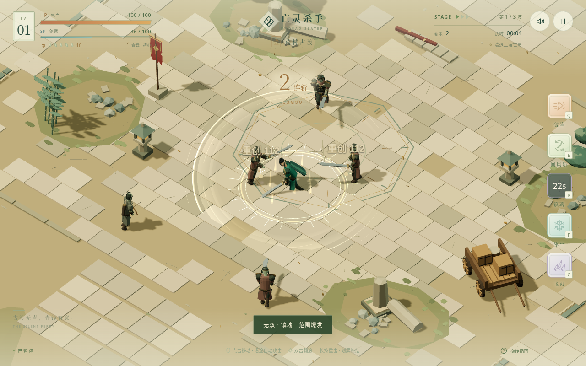

# 亡灵杀手 · LowPoly 国风测试关卡

使用 HTML + Three.js 制作的国风动作测试关卡：点击移动和追击、自动三段连击、双击翻滚，以及三波敌人与Boss。支持鼠标和触屏，默认使用横屏布局。开发模型：`gpt-6.1-sol`；开发分支：`Undead-Slayer`。

试玩地址：[jisolkun.github.io/KenShi](https://jisolkun.github.io/KenShi/)。

角色动作按偏刺客的方向重新编排：低位侧身持刀、前倾奔跑，三段连招分别使用斜向拔斩、反向回斩和下劈，提前衔接下一刀并保留蓄势。重击、肩滚、突进拔斩、交叉步旋斩、跃起重砸、冰牢手势、飞刃和瞬杀各有独立起势与收招；敌人的攻击与受击也同步重做。脚掌使用世界坐标接触与双骨骼求解，刀光沿实际刀刃轨迹生成。伤害、位移、刀光和音效共用动作时点，命中加入短暂停顿、方向受击、击退和镜头反馈，群体命中不会叠加停顿。

战场为 52×42 的连续区域，包含古寺、河湾、林石和近场残迹；角色采用肩肘、髋膝分层骨架和分片甲胄。Boss交替使用突入重砸与旋扫，红圈预警后进入恢复硬直。



[手机横屏触控画面](docs/mobile.png)

[刺客动作姿态检视](docs/actions.png)：翻滚、突进、旋风、跳砸、冰牢、飞刃和瞬杀的起势、命中与收招。

## 运行

需要 Node.js 20.19+ 或 22.12+。

```bash
npm install
npm run dev
```

打开终端显示的地址。生产构建和玩法验证：

```bash
npm run build
npm test
```

`npm test` 先检查全部11段攻击与技能的几何离地、30/60/120Hz下连招与技能切换，以及四类角色的支撑脚接触，再自动启动浏览器测试服务，使用系统 Chromium。可通过环境变量 `CHROMIUM_PATH` 指定浏览器路径，`TEST_PORT` 调整测试端口，`TEST_URL` 复用已启动的服务。浏览器验收包含桌面和手机交互，以及通过真实战斗清除三波敌人与Boss。

本轮通过21项浏览器验收。验收覆盖真实点击、双击、长按、划屏、技能、暂停与重启，包含 844×390 手机横屏和 390×844 自动旋转后的触控，以及三波19名敌人的实际战斗结算。生产版本另行检查 `/KenShi/` 资源路径、五个技能的共享命中时点和实际刀刃轨迹；浏览器无脚本错误。测试截图自动输出到 `test-results/`，文档实战图采用暂停抓帧以展示命中动作。

手机竖屏打开时，画面和操作区域会一起旋转为横屏。点击进入或继续时会尝试全屏及原生横屏锁定；浏览器不支持方向锁定时，自动旋转布局继续生效。

## 操作

- 点击地面：移动，自动斩击附近敌人。
- 点击敌人：追击并攻击目标。
- 双击地面：朝该方向翻滚闪避。
- 滑动屏幕：发动终结攻击，成功击杀可回复生命。
- 长按屏幕：蓄力发动EX攻击。
- 点击技能按钮，或按 `Q` / `E` / `R` / `F` / `C`：释放对应技能。
- 使用屏幕按钮暂停游戏或切换声音。

清除三波敌人并击败Boss即可通关。三星目标为通关、180秒内完成、受击少于2次；结算后可重新挑战。

五个技能以“突进、旋风、爆发、冰牢、飞刃”描述原型中的攻击和控制机制，这些名称不是经核实的原版技能名。

划屏瞬杀独立于 `R` 技能；各动作数值为本测试关卡设定。

## 参考与边界

玩法依据[公开资料与截图](docs/REFERENCE.md)重建，美术为原创 LowPoly 国风。原版逐帧动画和动作精确数值无法对齐，当前原型不宣称精确一比一复刻。只包含一个测试关卡，不含原版90关与装备、副将等养成系统。
